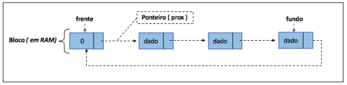
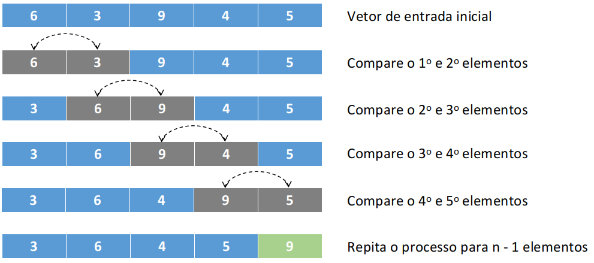
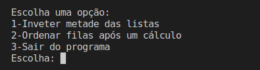
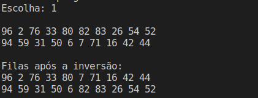
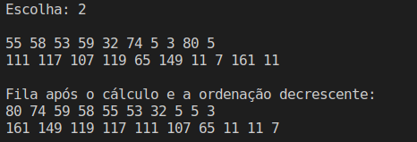

 
 
 
</a> 

# Problema Proposto

Uma estrutura baseada em fila tem por definição a regra de sempre remover do início e inserir
novos elementos no final. Sabendo-se disso, vamos praticar a utilização desse conceito nos
seguintes problemas:

&nbsp;&nbsp;&nbsp;&nbsp;&nbsp; a) Escreva uma função que receba pares de filas, ambas de tanho n, divida ambas ao meio
e ligue as metadas para compor duas novas filas, as quais devem ser retornadas para o
usuário. Tais filas devem ser definidas como dinâmicas. 

&nbsp;&nbsp;&nbsp;&nbsp;&nbsp; b) Escreva uma função que aplica uma equação matemática qualquer aos n  ̃umeros de uma
fila. Essa equação tem por objetivo produzir um indexador para a fila dada como entrada,
logo, precisa ser retornado junto com a fila para o usuário.

&nbsp;&nbsp;&nbsp;&nbsp;&nbsp; c) Elabore uma função que receba um conjunto de filas, todas com valores de indexação
conforme item (b). Ordene esse grupo de filas pelo método da bolha e as retorne ao
usuário considerando o maior valor de indexação como cabeça dessa ordem.

## A Estrutura Fila Dinâmica

 Na estrutura fila dinâmica, lidamos com ponteiros, criamos blocos em memória, tratamos do acesso e navegação utilizando o ponteiro próximo ( prox ) e, com isso, definimos e manipulamos os ponteiros frente e fundo sob um modelo circular, como na imagem abaixo. 

 
 

 
 
 

  Para inserções, utilizamos sempre o ponteiro de fundo. Em contra partida, utilizamos o ponteiro de frente para as remoções. Essa característica torna esse modelo de estrutura em um modelo do tipo First In First Out - FIFO. Mesma regra encontrada em sua vertente estática [vide git](https://github.com/mpiress/linear_queue).

 Com relação às estruturas dinâmicas básicas de lista e pilha, há uma diferença sutil de construção que deve ser observado na fila, a ligação do último elemento inserido à "cabeça" da estrutura. Essa modificação fará com que a estrutura se comporte exatamente da mesma forma de sua variante estática,ou seja, de forma circular.

## Método da Bolha 

 O bubble sort ou método da bolha é um método de ordenação por flutuação simples de custo computacional quadrático que utiliza sucessívas comparações para a realização de ordenação. 

 Em sua implementação, o vetor dado como entrada é percorrido inúmeras vezes e a cada passadagem é inserido (i.e., flutuado) para o fundo/fim do vetor o elemento de maior valor. Considerando sua forma de execução, pode-se observar que sua complexidade computacional o inviabiliza para grandes entradas. Em literatura, há certa divergência quanto ao tamanho máximo/ideal de entrada para sua aplicação, sendo essa definida entre 25 a 50 elementos. 

 Considerando um pequento exemplo com um vetor de 5 posições, vejamos como seria uma única interação do método para a ordenação de valores inteiros.  

 

Observe pela figura acima que a cada interação do algoritmo, apenas um elemento é colocado em ordem, o que exige muito trabalho durante o processo de composição da ordenação correta. Nesse processo, a cada interação o vetor é revisitado para os n - 1 elementos restantes, o que faz com que o método seja executado até que se tenha 2 elementos ainda não vizitados. 

## Algoritmo

 O problema foi desenvolvido da seguinte maneira: 

1 - Foi solicitado ao usuário o tamanho da fila.

2 - Um menu aparece na tela, e nele, o usuário tem 3 opções: Inverter metade das filas (exercício 3a), Realizar um cálculo aos valores da fila e ordenar a fila baseado nele (exercício 3b e 3c) e por fim, sair do programa.

 

3 - Se solicitado para inverter metade das filas e conectá-las, o programa preenche duas fila com valores randômicos X vezes o tamanho da fila recebido como input pelo usuário.

4 - Após as filas estarem completamente preenchidas, a função SwapFilas é chamada, e nela é passada as duas filas e o tamanho delas como parâmetro. A fila é percorrida até a metade e seus valores são permutados, assim conectando metade das listas.

5 - Por fim, ambas as listas permutadas são mostradas na tela e o menu é chamado novamente para o usuário.

 
 

6 - Se solicitado para realizar um cálculo aos valores da fila e ordená-la, o programa preenche uma fila com valores randômicos X vezes o tamanho da fila recebido como input pelo usuário.

7 - Após as filas estarem completamente preenchidas, a função MetodoBolhaInterativo é chamada, e nela é passada a fila como parâmeto. O método consiste em comparar o primeiro e o último valor da lista e caso o último valor seja menor, os valores são permutados. 

8 - Por fim, a lista ordenada de forma descrescente é mostrada na tela, e o menu é chamado novamente para o usuário.

 

# Compilação e Execução

O algoritmo de listas disponibilizado possui um arquivo Makefile que realiza todo o procedimento de compilação e execução. Para tanto, temos as seguintes diretrizes de execução:

| Comando                |  Função                                                                                           |
| -----------------------| ------------------------------------------------------------------------------------------------- |
|  `make clean`          | Apaga a última compilação realizada contida na pasta build                                        |
|  `make`                | Executa a compilação do programa utilizando o gcc, e o resultado vai para a pasta build           |
|  `make run`            | Executa o programa da pasta build após a realização da compilação                                 |

# Contatos

 
 Thaissa Vitória

 
Bárbara Gualberto

 

 Gabriel Couto

<a href="https://t.me/Couto1411">
 

  
  

 Pablo Sousa

<a href="https://t.me/Pabloss_07">
 

