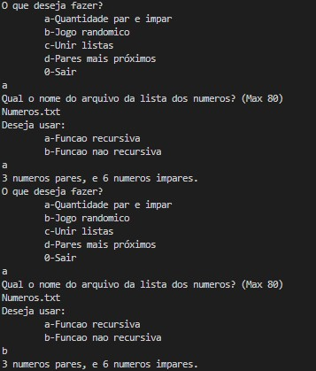
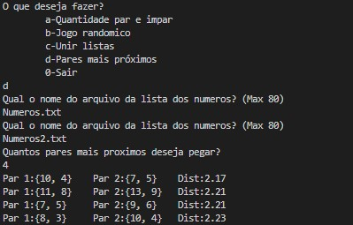
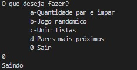

 
 
 
</a> 

# Problema Proposto

Considerando nossos modelos de lista (i.e., linear e dinâmica), realize as solicitações de implementação a seguir, considerando para isso estruturar sua solução da seguinte forma: 
  

  
i) Uma implementação por letra e; 

  
ii) Uma implementação magma que conecte todas as letras por um único menu para execução.

<ul style="none">
<li> Escreva uma função recursiva e outra não recursiva para contar o número de elementos pares e impares contidos em uma lista dinâmica. </li>
 
 <li>Crie uma função que simule um pequeno jogo que utiliza duas listas (i.e., L1 e L2). Nesse, cada lista possui tamanho máximo de 3 entradas e cada posição deve armazenar um número inteiro aleatório entre 1 e 13. Nesse jogo, após preencher ambas as listas, selecione também de forma aleatória mais um valor entre 1 e 13 e mostre-o na tela. A regra do jogo é a seguinte: Ambas as listas devem ser apresentadas por leitura sequencial a partir de suas posições de paridade, ou seja, {{L1[0], L2[0]}, {L1[1], L2[1]}, {L1[2], L2[2]}}. Cada par deve ser subtraído do valor apresentado e ganha o jogo a lista que apresentar a maior soma final. Mostre o ganhador ao final.</li>
 
 <li>Escreva uma função que receba duas listas x = [x1, x2, . . . , xn] e y = [y1, y2, . . . , yn] e retorne uma lista z = [(x1, yn),(x2, yn−1, . . . ,(xn, y1)]. Ao final, as listas x e y devem estar vazias.</li>
 
 <li>Escreva uma função que receba pares de listas x = [x1, x2, . . . , xn] e y = [y1, y2, . . . , ym] com n, m > 0 e n = m. Calcule a distância euclidiâna entre os múltiplos pares recebidos e encontre os k pares mais próximos.</li>
  </ul>

## Lógica
O programa a seguir apresenta algoritmos baseados de: [Dynamic_List](https://github.com/mpiress/dynamic_list.git), [Linear_List](https://github.com/mpiress/linear_list.git) e [Insertion_Sort](https://github.com/mpiress/InsertionSort.git)      
       
1) Ao entrar no programa, entramos em um looping que contem o seguinte menu (a-Quantidade par e impar,b-Jogo randomico,c-Unir listas,d-Pares mais próximos,0-Sair), a cada iteração resetamos as listas utilizadas no programa         
- Caso opcao=a:
  - Encontra uma função *preencheLista(&l1)* que pega a lista de um arquivo de formato específico a partir do nome informado;      
  - Pergunta ao usuário se deseja buscar a quantidade de pares e ímpares a partir de uma função recursiva (a) ou uma função não recursiva (b)     
    - Caso opcao=a:
      - Entra na função *countImpar(&l1)* com a opcao verdadeira e chama uma função *EvenNum(primeiro numero da lista)*:
        - Se não está no final da lista verifica se é par, se sim retorna 1+ *EvenNum(proximo número)*, e soma um a um ponteiro de tamanho a cada iteração;     
      - Com o número de pares calculados e do tamanho também, subtrai os pares do tamanho tendo assim os ímparees, e apresenta ao usuário;     
    - Caso opcao=b:
      - Percorre a lista verificando a paridade de cada item e somando a uma variável par e uma impar, e deposi aprensentando ao usuário;     
- Caso opcao=b:
  - Encontra a função *listaRand()* que preenche duas listas estáticas com três números randômicos cada e escolhe dois fatores também randômicos, todos os itens entre 1 e 13, depois soma cada item de cada lista e subtrai o fator da lista a cada item que ela possui, o programa diz qual lista possui maior soma no final;    
- Caso opcao=c:
  - Preenche duas listas assim como na opcao=a, e entra em uma função *uneListasContrarias(&l1,&l2,&l3)*:
    - Existe um looping que percorre l1, a cada iteração existe um auxiliar que caminha por l2 até chegar no ultimo número, então preenche-se uma l3 com o primeiro número de l1 e o último de l2, a cada iteração a cabeça de l1 passa para o próximo número, e a cauda de l2 passa para o anterior;
- Caso opcao=d:
  - Preenche duas listas assim como na opcao=a, e entra em uma função *uneListas(&l1,&l2,&l3)*:
    - Primeiro, de maneira similar a opcao=c, unimos as listas l1 e l2 só que não contrárias, alem de calcular a distancia euclidianas entre l1[x] e l2[x];     
    - Depois, calculamos a distancia que cada par tem entre si, ordenamos a lista a partir de um *InsertionSort*, e perguntamos ao usuário quantos k pares mais próximos ele deseja saber, e apresentamos essa quantidade.      

Obs.:    
- O arquivo deve ser dado de maneira:
>a1    
>a2     
>a3     
>a...        
>an      
>     
>onde *a* é um inteiro    

- Para a opção c e d as listas devem possuir o mesmo tamanho       
- Para a opção d, k deve ser menor que o tamanho da lista

# Exemplo de Execução
Numeros.txt:
> -10     
> -5     
> 8     
> 10    
> 7     
> 9     
> 3    
> 11    
> 13    

Numeros2.txt:
> 1     
> 2     
> 3     
> 4     
> 5     
> 6       
> 7    
> 8     
> 9     

Opcao a:

	 

 

Opcao b:

	 

 

Opcao c:

	 

 

Opcao d:

	 

 

Opcao 0:

	 

 

# Compilação e Execução

O algoritmo de listas disponibilizado possui um arquivo Makefile que realiza todo o procedimento de compilação e execução. Para tanto, temos as seguintes diretrizes de execução:

| Comando                |  Função                                                                                           |
| -----------------------| ------------------------------------------------------------------------------------------------- |
|  `make clean`          | Apaga a última compilação realizada contida na pasta build                                        |
|  `make`                | Executa a compilação do programa utilizando o gcc, e o resultado vai para a pasta build           |
|  `make run`            | Executa o programa da pasta build após a realização da compilação                                 |

# Contatos

 
 Thaissa Vitória

 
Bárbara Gualberto

 

 Gabriel Couto

<a href="https://t.me/Couto1411">
 

  
  

 Pablo Sousa

<a href="https://t.me/Pabloss_07">
 

