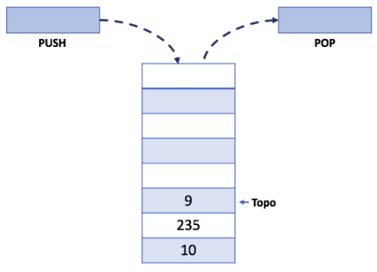
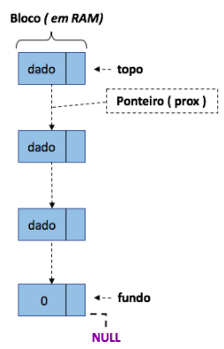
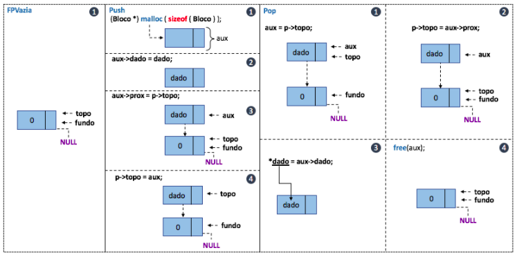
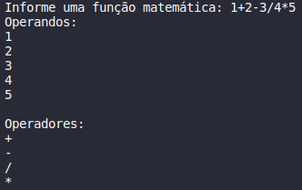

 
 
 
</a> 

<h4><i>Todos os problemas propostos foram feitos utilizando a estrutura de pilha.</i></h4>

# Pilhas Lineares

A pilha possui uma regra básica que deve ser obedecida, essa se refere a forma como inserimos e removemos elementos dessa estrutura. Antes de iniciarmos essa discussão, observe um exemplo ilustrativo desse tipo de dados na figura abaixo.

	
 

	 
	
 

Observe que nesse tipo de estrutura há apenas um <b>único ponteiro</b> chamado <b>Topo</b>. Os métodos associados ao tipo pilha, os quais impõem as regras, são chamados PUSH (i.e., empilhar) e POP (i.e., desempilhar).

>Logo, temos como regra básica dessa estrutura: 
> 1. O último elemento que entra sempre será o primeiro a ser removido. 

Como a pilha é definida a partir de um vetor, muitas das caracteristicas de implementação observadas no tipo lista são aproveitados para compor sua execução. A diferença está apenas na composição da regra de manipulação, o que as diferencia em termos de execução. 

# Pilhas Dinâmicas 

Para o desenvolvimento de um tipo pilha dinâmica, precisamos reservar memória para alocar nossos blocos de dados. Além disso, precisamos criar um bloco chamado "cabeça" para que nossos apontadores possam existir e manipular corretamente as regras da estrutura que estamos tratando.

Na pilha, é preciso definir apontadores para <b>fundo</b> e <b>topo</b> e esses são tratados da mesma forma que os ponteiros primeiro e ultimo de uma lista dinâmica [vide git](https://github.com/mpiress/dynamic_list). Também segue as mesmas regras de inserção e remoção de sua estrutura estática [vide git](https://github.com/mpiress/linear_stack). Vejamos uma representação gráfica da pilha dinâmica e como se comportam os blocos armazenados na memória.

	 

Em linhas gerais, a estrutura pilha é muito semelhante a uma lista dinâmica, exceto por inverter a forma como os ponteiros de inicialização são manipulados. Uma vez que, a pilha tem como regra o último que entra é o primeiro a sair, (do inglês, Last In First Out - LIFO), a lógica de manipulação dos ponteiros deve ser modificada para se adaptar a essa regra. Dessa forma,  um novo bloco é inserido utilizando o ponteiro de topo e esse novo bloco apontará para o último já inserido. Note que, ao contrário de fazer o ponteiro de topo (ou último em lista) apontar para o próximo, faz-se o ponteiro de próximo do novo bloco apontar para o topo e só depois atualizaremos o topo para a posição de memória do novo bloco. Vejamos a representação das funções de inicialização (FPVazia), inserção (Push) e remoção (Pop) de uma pilha dinâmica.

	 

# Problemas Propostos

É de nosso conhecimento que a estrutura do tipo pilha define regras de manipulação que não podem ser modificadas e que essas são comumente citadas como ações de PUSH (empilhar) e POP (desempilhar). Sabendo-se disso e mediante as regras de desenvolvimento já apresentadas faça:
 

<b>a)</b> Escreva uma função que receba uma equação matemática qualquer e retorne duas pilhas. Uma contendo os operandos empilhados da esquerda para a direita e outra contendo os operadores seguindo mesma linha de leitura.
 

	
- Neste problema a estrutura utlizada foi uma pilha linear por ser mais fácil de implementar e porque o problema não necessitava de grandes implementações mais complexas como alocação de memória.
- A resolução consistiu em receber uma função matemática qualquer do usuário e empilhar cada termo (seja ele um número ou um operador matemático) em pilhas de seus respectivos tipos. A primeira pilha para operandos e a segunda para operadores, de modo que a ordem mostrada para o usuário é a mesma que ele a digitou.
	

	 

	
<b>b)</b> Considerando a função elaborada no item (a), crite uma segunda função que apresente a operação matemática em notação prefixa e posfixa. Veja alguns exemplos na tabela abaixo (i.e., Tabela 1.)
  

  

  <b>Figure 1: Exemplos de escrita infixa, prefixa e posfixa</b>
  

|   Expressão Infinita   |   Expressão Prefixa   |   Expressão Posfixa   |  
| -----------------------|-----------------------|-----------------------| 
|     A + B * C + D      |    ++ A * B  C  D     |      A B C * + D +    | 
|   (A + B) * (C + D)    |    *+ A  B + C  D     |      A B + C D + *    | 
|     A * B + C * D      |    +* A  B * C  D     |      A B * C D * +    | 
|     A + B + C + D      |    +++ A  B  C  D     |      A B + C + D +    | 

 

 

	
- Neste problema a estrutura utlizada foi uma pilha linear por ser mais fácil de implementar e porque o problema não necessitava de grandes implementações mais complexas como alocação de memória.

<b>c)</b> Elabore uma função que receba uma pilha P1 com 20 posições preenchidas por números inteiros aleatórios entre 1 e 99. Para cada número da pilha, utilize a função totiente de Euler para encontrar para esse número os co-primos. Mostre-os na tela como resultado de sua execução.
  

<b>d)</b> Crie uma função para realizar o calculo de fibonacci para um valor de N. Contudo, utilize uma pilha para armazenar os pré resultados, utilizando-os para outros calculos sempre que possível. Para tanto, considere manter no topo da pilha o cálculo para o valor de (n-1). Crie uma forma de identificar para qual n-1 o valor foi cálculado para não utilizar valores incorretos para calculos longos. Feito isso responda: Manter os cálculos em pilha pode ajudar a economizar computações? Quando seria melhor empregado?

<dl>
	<dt> Manter os cálculos em pilha pode ajudar a economizar computações?</dt>
Sim! Calculado o Fibonacci de um valor inicial n, se depois for necessário calcular o valor de um outro valor a pilha seria aproveitada, poupando assim a necessidade de fazer os cáculos desde o início novamente. Sendo que, para valores menores que n, basta achar na pilha o Fibonacci correspondente e, para valores maiores que n, basta continuar o calculo a partir do Fibonacci de n.</dd>
	 <dt>Quando seria melhor empregado?</dt>
	<dd> Em uma situação em que todos os Fibonaccis a serem calculados fossem menor do que n, assim, o algoritmo precisaria realizar o Fibonacci apenas uma vez e depois só teria que encontrar o restante dos Fibonaccis na pilha.</dd>	
</dl>

# Compilação e Execução

O algoritmo de pilhas disponibilizado possui um arquivo Makefile que realiza todo o procedimento de compilação e execução. Para tanto, temos as seguintes diretrizes de execução:

| Comando                |  Função                                                                                           |
| -----------------------| ------------------------------------------------------------------------------------------------- |
|  `make clean`          | Apaga a última compilação realizada contida na pasta build                                        |
|  `make`                | Executa a compilação do programa utilizando o gcc, e o resultado vai para a pasta build           |
|  `make run`            | Executa o programa da pasta build após a realização da compilação                                 |

# Contatos

 
 Thaissa Vitória

 
Bárbara Gualberto

 

 Gabriel Couto

<a href="https://t.me/Couto1411">
 

  
  

 Pablo Sousa

<a href="https://t.me/Pabloss_07">
 

